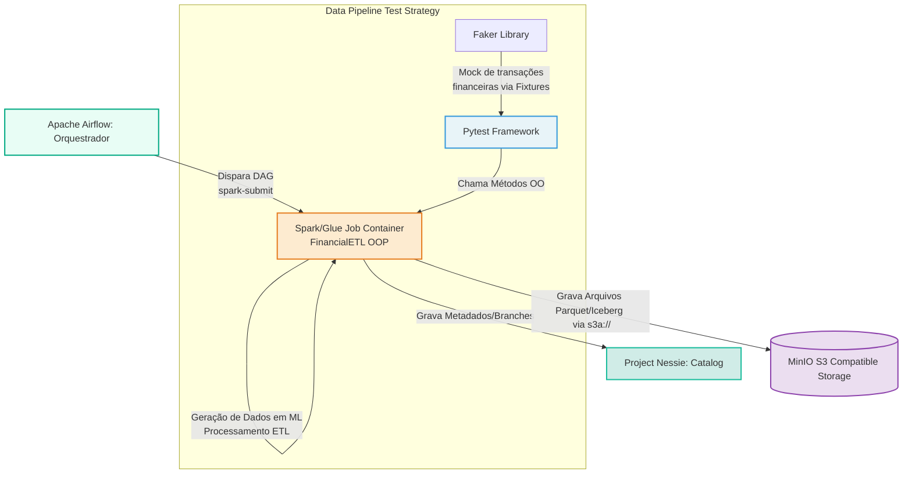

# AWS Glue ETL Simulation (PySpark, Iceberg, Airflow, MinIO)

Este projeto demonstra a criação e orquestração de uma pipeline de dados moderna simulando o AWS Glue. Ele constrói um ambiente de desenvolvimento reproduzível utilizando **Podman**, orquestrando jobs de ETL com o **Apache Airflow**, processando dados sintéticos (gerados por `Faker`) usando **PySpark**, e armazenando com formato Open Table **Apache Iceberg**, em cima de uma camada de storage **MinIO** (simulando AWS S3).

## Arquitetura da Solução

O fluxo geral consiste na orquestração de uma DAG pelo Airflow, que dispara a execução de uma classe fortemente tipada e orientada a objetos correspondente ao job de ETL do Spark. O Spark lê metadados, aplica transformações aos campos sintéticos de transações financeiras e insere esses registros numa tabela Iceberg armazenada no MinIO.



## Como Rodar

### Pré-requisitos
- [Podman](https://podman.io/) (ou Docker)
- Podman Compose (ou Docker Compose)

### Passos

1. **Subir os serviços (Airflow, MinIO, Postgres):**
    ```sh
    podman compose up -d
    ```
    *(Aguarde alguns instantes até que o Airflow inicialize o banco de dados).*

3. **Acessar os Recursos:**
    - **Apache Airflow Interface**: `http://localhost:8080` (user: `airflow`, pass: `airflow`)
    - **MinIO Console (S3 Mock)**: `http://localhost:9001` (user: `minioadmin`, pass: `minioadmin`)
    - **Nessie Catalog API**: `http://localhost:19120/api/v1`

3. **Execução do Job Glue (Spark/Iceberg)**:
    No painel do Airflow, ligue (`Unpause`) a DAG `financial_glue_simulation_trigger` e aperte Play. 
    Se quiser rodar os scripts de modo manual dentro do contêiner do scheduler:
    ```sh
    podman exec -it <nome_do_container_scheduler_airflow> bash
    python dags/financial_etl_dag.py
    ```

### Rodando a Suíte de Testes (Pytest)
O Airflow roda com um ambiente Python 3.10. Para executar todos os testes localmente sem o Airflow (você precisa de Java 17+ instalado na sua máquina):
```sh
pip install -r requirements.txt
pytest tests/ -v
```
